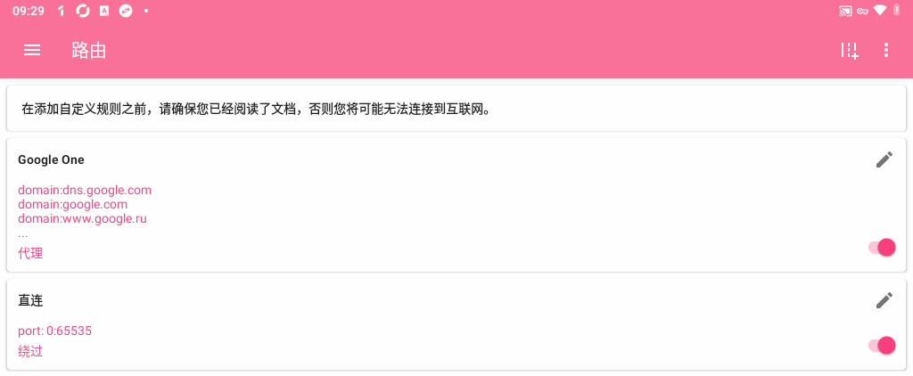

# [nekobox](https://github.com/MatsuriDayo/NekoBoxForAndroid)规则

## 代理

- 精确匹配认证，2023_12_22测试有效

```
domain:dns.google.com
domain:google.com
domain:www.google.ru
domain:www.google.com
domain:firebaseremoteconfig.googleapis.com
domain:prod.brass.cloud.cupronickel.goog
domain:phosphor-pa.googleapis.com
domain:connectivitycheck.gstatic.com
```

- 可能有用的

```
domain:assouth.p.g-tun.com
domain:prod.zinc.cloud.cupronickel.goog
domain:accounts.google.com
domain:cloud.cupronickel.goog
domain:googleapis.com

```

## 直连

```
port 0:65535
```



